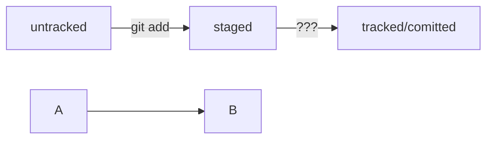

# Tips of using Git

----

## Bash commands

1. `cd` dir_name
2. `ls`, `l`
3. `mkdir` dir_name
4. `pwd`
5. `cp` file1 file2
6. `mv` file1 file2
7. `rm` file2

## Git commands

1. `git init`
2. `git add` file_name
3. `git config user.name` 'Oleg Cybulsky'
4. `git config user.email` 'alogic-ru@yandex.com'
5. `git commit -m` 'Commit description' `-m` 'Next string description'
6. `git remote add origin` 'repository_name'
7. `git remote -v` # check connected remote repository
8. `git push -u origin master` # push master branch to remote server
9. `git status` # show staged and modified files
10. `git restore --staged <file>` # unstage file, modifications peserved
11. `git restore <file>` # undo changes in modified file
12. `git reset --hard <commit hash>` # move HEAD to commit, remove commits above
13. `git diff` # checks commited version against modified
14. `git diff --staged` # checks commited against staged
15. `git diff <commit1> <commit2>` # show changes between commits

### .gitignore rules
```
# ignore all .a files
*.a

# but do track lib.a, even though you're ignoring .a files above
!lib.a

# only ignore the TODO file in the current directory, not subdir/TODO
/TODO

# ignore all files in any directory named build
build/

# ignore doc/notes.txt, but not doc/server/arch.txt
doc/*.txt

# ignore all .pdf files in the doc/ directory and any of its subdirectories
doc/**/*.pdf
```

### Branches

To get remote branches localy:  
```bash
git branch -r | grep -v '\->' | sed "s,\x1B\[[0-9;]*[a-zA-Z],,g" | while read remote; do git checkout "${remote#origin/}"; done
```
or just:  
```bash
git branch -r | grep -v '\->' | while read remote; do git checkout "${remote#origin/}"; done
```

To keep password for remote in memory for a few minutes:  
`git config --global credential.helper cache`





